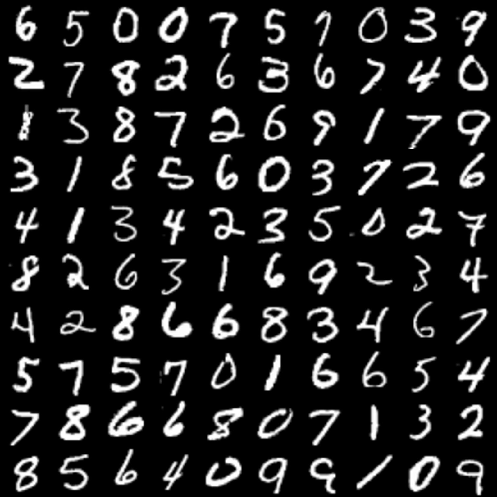
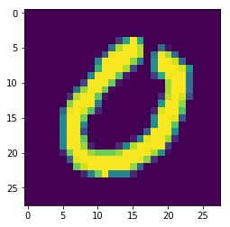
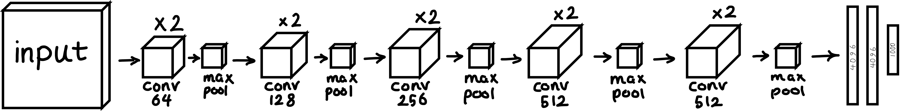

# vgg13-tensorlfow

- This is a new implementation of VGG13 Convolutional Neural network with the new TensorFlow APIs (TensorFlow > v1.4)

In this project we are going to:
1. Prepare the environment (e.g., importing the required libraries)
2. Load a dataset to train on (MNIST dataset) 
3. Implement a fully functioning ConvNet using TensorFlow
4. Train the implemented model on the dataset
5. Analyze the results


## 1. Preparing the environment
We import the numpy, TensorFlow, and matplotlib libraries to do some graphing.
```python
from __future__ import absolute_import
from __future__ import division
from __future__ import print_function

# Imports
import numpy as np
import tensorflow as tf
import matplotlib.pyplot as plt
tf.logging.set_verbosity(tf.logging.INFO)

%matplotlib inline
np.random.seed(1)
```

## 2. Load the MNIST dataset:
The MNIST dataset contains handwritten digits in grayscale. Some sample images are shown below:



This dataset is built-in in the TensorFlow. Using TF APIs we can easily load the train and eval/test MNIST data:
```python
# Loading the data (signs)
mnist = tf.contrib.learn.datasets.load_dataset("mnist")
train_data = mnist.train.images  # Returns np.array
train_labels = np.asarray(mnist.train.labels, dtype=np.int32)
eval_data = mnist.test.images  # Returns np.array
eval_labels = np.asarray(mnist.test.labels, dtype=np.int32)
```
To check if the dataset has been loaded properly, you can plot a random index from the train set using the code snippet below:

```python
index = 7
plt.imshow(train_data[index].reshape(28, 28))
print ("y = " + str(np.squeeze(train_labels[index])))
``` 
this shows the below image which is a 0:



Now, let's see some statistics about the dataset we just loaded:

```python
print ("number of training examples = " + str(train_data.shape[0]))
print ("number of evaluation examples = " + str(eval_data.shape[0]))
print ("X_train shape: " + str(train_data.shape))
print ("Y_train shape: " + str(train_labels.shape))
print ("X_test shape: " + str(eval_data.shape))
print ("Y_test shape: " + str(eval_labels.shape))
```
which prints out:
```
number of training examples = 55000
number of evaluation examples = 10000
X_train shape: (55000, 784)
Y_train shape: (55000,)
X_test shape: (10000, 784)
Y_test shape: (10000,)
```
To summarize, we have 55K training images, each with a size of 28 x 28. Each image is flattened when loading the dataset meaning, each row of training data which contains one single image is a very long vector of size `28*28=784`. Later in the implementation we see that the input to our network is defined as `[28, 28]`. When defining the input tensor, Tensorflow automatically reshapes each vectorized image to `[28,28]` to carry out the convolution operations. The same thing applies to our eval/test dataset which contains 10K image.

## 3. Implement the full VGG13 CNN:
For simplicity of this tutorial we implement the vgg13. Following the same logic you can easily implement VGG16 and VGG19. From the original [VGG paper](https://arxiv.org/abs/1409.1556) the architecture for VGG13 is described along others in a table:


VGG13 is model **B** in the above table. For the sake of this tutorial and to get a better picture of the network. I have drawn the network in the block diagram fashion:



As you see the model follows the sequence of operations as below:

`2 x CONV2D(64) -> RELU -> MAXPOOL -> 2 x CONV2D(128) -> RELU -> MAXPOOL -> 2 x CONV2D(256) -> RELU -> MAXPOOL -> 2 x CONV2D(512) -> RELU -> MAXPOOL -> 2 x CONV2D(512) -> RELU -> MAXPOOL -> FLATTEN -> FC1(4096) -> FC2(4096) -> FC3(1000) -> output`

Notes: 
- each `CONV2D` is a `3x3` filter with `stride = 1`, and `same` padding.
- each max pooling layer is `2x2` kernel with `stride = 2` and `same` padding.

we implement the VGG13 model in a function called `cnn_model_fn(features, labels, mode)` and later pass it to our estimator object to train.

In TF, there are built-in functions that carry out convolution, maxpooling, and FC steps:

- **`tf.layers.conv2d(input, num_filters, filter_size, padding='same', activation=tf.nn.relu)`:** given an input and a group of filters, this function convolves filters on the input.

- **`tf.layers.max_ppoling2d(input, pool_size, strides, padding='same')`:** given an input, this function uses a window of size `pool_size` and strides to carry out max pooling over each window.

- **`tf.contrib.layers.flatten(P)`**: given an input P, this function flattens each example into a 1D vector it while maintaining the batch-size. It returns a flattened tensor with shape [batch_size, k].

- **`tf.layers.dense(input, units, activation=tf.nn.relu)`:** given a the flattened input, it returns the output computed using a fully connected layer. The `units' determine the number of neuron in the FC layer.

Now let's get our hands dirty:

```python
def cnn_model_fn(features, labels, mode):
    # Input Layer
    input_height, input_width = 28, 28
    input_channels = 1
    input_layer = tf.reshape(features["x"], [-1, input_height, input_width, input_channels])

    # Convolutional Layer #1 and Pooling Layer #1
    conv1_1 = tf.layers.conv2d(inputs=input_layer, filters=64, kernel_size=[3, 3], padding="same", activation=tf.nn.relu)
    conv1_2 = tf.layers.conv2d(inputs=conv1_1, filters=64, kernel_size=[3, 3], padding="same", activation=tf.nn.relu)
    pool1 = tf.layers.max_pooling2d(inputs=conv1_2, pool_size=[2, 2], strides=2, padding="same")
    
    # Convolutional Layer #2 and Pooling Layer #2
    conv2_1 = tf.layers.conv2d(inputs=pool1, filters=128, kernel_size=[3, 3], padding="same", activation=tf.nn.relu)
    conv2_2 = tf.layers.conv2d(inputs=conv2_1, filters=128, kernel_size=[3, 3], padding="same", activation=tf.nn.relu)
    pool2 = tf.layers.max_pooling2d(inputs=conv2_2, pool_size=[2, 2], strides=2, padding="same")

    # Convolutional Layer #3 and Pooling Layer #3
    conv3_1 = tf.layers.conv2d(inputs=pool2, filters=256, kernel_size=[3, 3], padding="same", activation=tf.nn.relu)
    conv3_2 = tf.layers.conv2d(inputs=conv3_1, filters=256, kernel_size=[3, 3], padding="same", activation=tf.nn.relu)
    pool3 = tf.layers.max_pooling2d(inputs=conv3_2, pool_size=[2, 2], strides=2, padding="same")

    # Convolutional Layer #4 and Pooling Layer #4
    conv4_1 = tf.layers.conv2d(inputs=pool3, filters=512, kernel_size=[3, 3], padding="same", activation=tf.nn.relu)
    conv4_2 = tf.layers.conv2d(inputs=conv4_1, filters=512, kernel_size=[3, 3], padding="same", activation=tf.nn.relu)
    pool4 = tf.layers.max_pooling2d(inputs=conv4_2, pool_size=[2, 2], strides=2, padding="same")

    # Convolutional Layer #5 and Pooling Layer #5
    conv5_1 = tf.layers.conv2d(inputs=pool4, filters=512, kernel_size=[3, 3], padding="same", activation=tf.nn.relu)
    conv5_2 = tf.layers.conv2d(inputs=conv5_1, filters=512, kernel_size=[3, 3], padding="same", activation=tf.nn.relu)
    pool5 = tf.layers.max_pooling2d(inputs=conv5_2, pool_size=[2, 2], strides=2, padding="same")

    # FC Layers
    pool5_flat = tf.contrib.layers.flatten(pool5)
    FC1 = tf.layers.dense(inputs=pool5_flat, units=4096, activation=tf.nn.relu)
    FC2 = tf.layers.dense(inputs=FC1, units=4096, activation=tf.nn.relu)
    FC3 = tf.layers.dense(inputs=FC2, units=1000, activation=tf.nn.relu)

    """the training argument takes a boolean specifying whether or not the model is currently 
    being run in training mode; dropout will only be performed if training is true. here, 
    we check if the mode passed to our model function cnn_model_fn is train mode. """
    dropout = tf.layers.dropout(inputs=FC3, rate=0.4, training=mode == tf.estimator.ModeKeys.TRAIN)
    
    # Logits Layer or the output layer. which will return the raw values for our predictions.
    # Like FC layer, logits layer is another dense layer. We leave the activation function empty 
    # so we can apply the softmax
    logits = tf.layers.dense(inputs=dropout, units=10)
    
    # Then we make predictions based on raw output
    predictions = {
        # Generate predictions (for PREDICT and EVAL mode)
        # the predicted class for each example - a vlaue from 0-9
        "classes": tf.argmax(input=logits, axis=1),
        # to calculate the probablities for each target class we use the softmax
        "probabilities": tf.nn.softmax(logits, name="softmax_tensor")
    }
    
    # so now our predictions are compiled in a dict object in python and using that we return an estimator object
    if mode == tf.estimator.ModeKeys.PREDICT:
        return tf.estimator.EstimatorSpec(mode=mode, predictions=predictions)
    
    
    '''Calculate Loss (for both TRAIN and EVAL modes): computes the softmax entropy loss. 
    This function both computes the softmax activation function as well as the resulting loss.'''
    loss = tf.losses.sparse_softmax_cross_entropy(labels=labels, logits=logits)

    # Configure the Training Options (for TRAIN mode)
    if mode == tf.estimator.ModeKeys.TRAIN:
        optimizer = tf.train.GradientDescentOptimizer(learning_rate=0.001)
        train_op = optimizer.minimize(loss=loss, global_step=tf.train.get_global_step())
        
        return tf.estimator.EstimatorSpec(mode=mode, loss=loss, train_op=train_op)

    # Add evaluation metrics (for EVAL mode)
    eval_metric_ops = {
        "accuracy": tf.metrics.accuracy(labels=labels,
                                        predictions=predictions["classes"])}
    return tf.estimator.EstimatorSpec(mode=mode,
                                      loss=loss,
                                      eval_metric_ops=eval_metric_ops)
```

**Note:** the output of each layer is the input for the next layer!

## 4. Training:

First, we create an estimator object and name it `mnist_classifier`. We inject our model `cnn_model_fn` to this estimator and define a path to save training checkpoint in case something happens and you want to resume the training

```python
mnist_classifier = tf.estimator.Estimator(model_fn=cnn_model_fn,
                                          model_dir="/tmp/mnist_vgg13_model")
```

Next, we define training parameters and hyperparameters for our network including inputs, labels, batch size, and number of epochs. We also shuffle the data before training.

```python
train_input_fn = tf.estimator.inputs.numpy_input_fn(x={"x": train_data},
                                                        y=train_labels,
                                                        batch_size=100,
                                                        num_epochs=100,
                                                        shuffle=True)
```
Then we train our estimator object we created with the input function and properties we just defined:
```python
mnist_classifier.train(input_fn=train_input_fn,
                       steps=None,
                       hooks=None)
```
For testing, we define an evaluation input function and propoerties and use our `mnist_classifier` estimator object in **evaluation** mode. 

```python
eval_input_fn = tf.estimator.inputs.numpy_input_fn(x={"x": eval_data},
                                                   y=eval_labels,
                                                   num_epochs=1,
                                                   shuffle=False)
eval_results = mnist_classifier.evaluate(input_fn=eval_input_fn)
print(eval_results)
```

Here is the result of training:
```
INFO:tensorflow:loss = 2.3024457, step = 1
INFO:tensorflow:global_step/sec: 33.3624
INFO:tensorflow:loss = 2.3024359, step = 101 (2.999 sec)
INFO:tensorflow:global_step/sec: 34.6312
INFO:tensorflow:loss = 2.3019745, step = 201 (2.887 sec)
INFO:tensorflow:global_step/sec: 34.5752
INFO:tensorflow:loss = 2.3018668, step = 301 (2.893 sec)
.
.
.
.
INFO:tensorflow:loss = 0.024871288, step = 54901 (2.920 sec)
INFO:tensorflow:Saving checkpoints for 55000 into /tmp/mnist_vgg13_model/model.ckpt.
INFO:tensorflow:Loss for final step: 0.007031409.
INFO:tensorflow:Starting evaluation at 2018-02-22-01:01:23
INFO:tensorflow:Restoring parameters from /tmp/mnist_vgg13_model/model.ckpt-55000
INFO:tensorflow:Finished evaluation at 2018-02-22-01:01:24
INFO:tensorflow:Saving dict for global step 55000: accuracy = 0.9842, global_step = 55000, loss = 0.055481646
{'accuracy': 0.9842, 'loss': 0.055481646, 'global_step': 55000}
```
You can see that we have successfully trained a VGG13 on MNIST dataset and we achieved an accuracy of **98.42%**. You can refer to the jupyter notebook in this repository to see more in depth execution of the code.